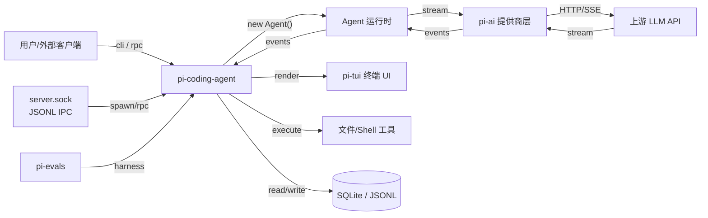
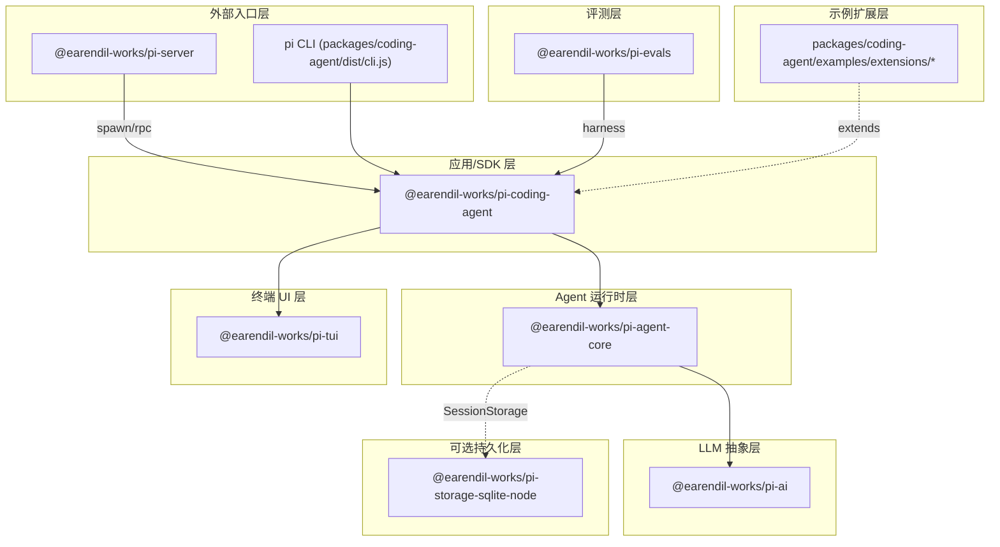
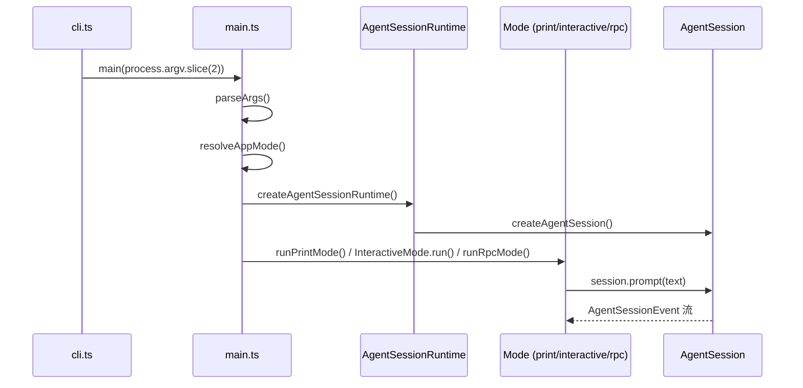
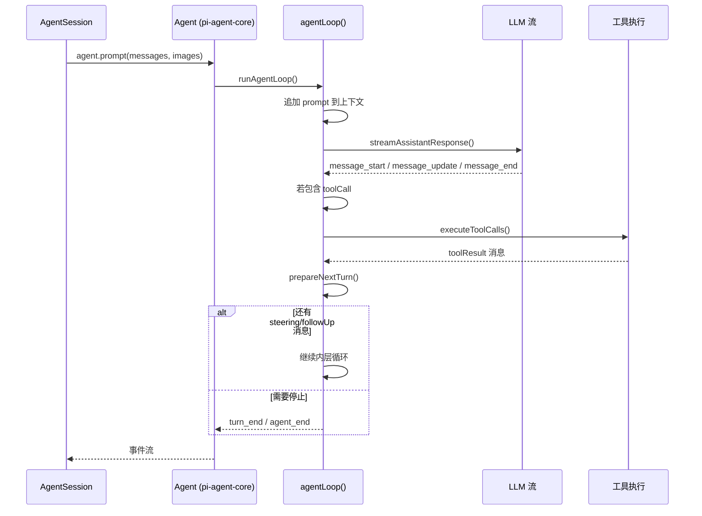
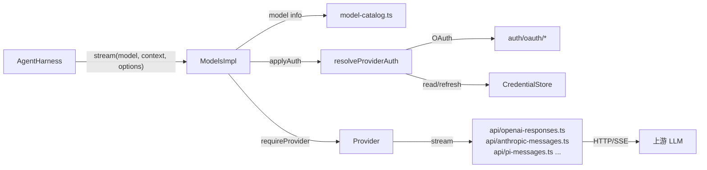
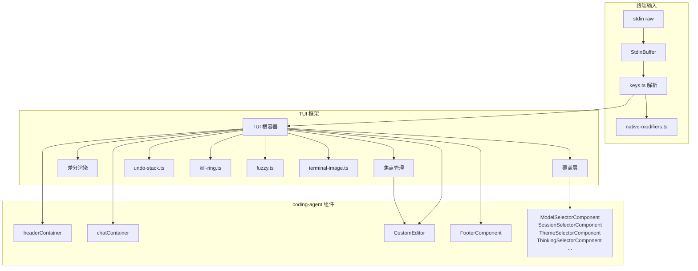
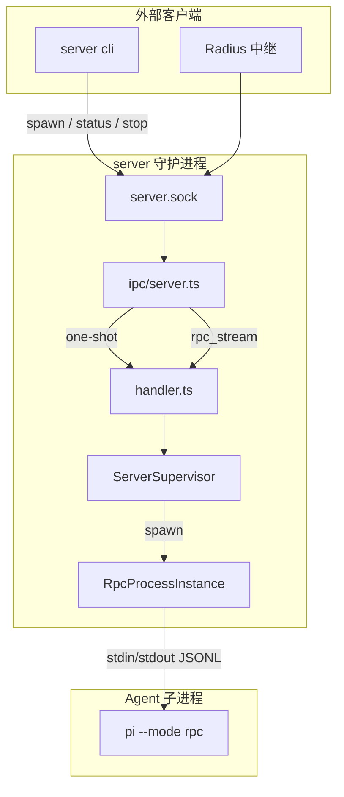

# Pi 软件流程架构分析

> 分析范围：Pi monorepo 七个核心工作区（`packages/coding-agent`、`packages/agent`、`packages/ai`、`packages/tui`、`packages/server`、`packages/evals`、`packages/storage/sqlite-node`）以及若干示例扩展工作区，重点描述它们之间的调用与数据流。

## 目录

- [1. 概览](#1-概览)
- [2. 包架构分层](#2-包架构分层)
- [3. 入口与运行模式](#3-入口与运行模式)
  - [3.1 CLI 入口](#31-cli-入口)
  - [3.2 运行模式](#32-运行模式)
  - [3.3 模式数据流](#33-模式数据流)
- [4. 核心流程](#4-核心流程)
  - [4.1 CLI 解析与会话解析](#41-cli-解析与会话解析)
  - [4.2 AgentSession 构造](#42-agentsession-构造)
  - [4.3 Agent 循环](#43-agent-循环)
  - [4.4 LLM 提供商抽象](#44-llm-提供商抽象)
  - [4.5 工具执行](#45-工具执行)
  - [4.6 交互式渲染与 TUI](#46-交互式渲染与-tui)
  - [4.7 上下文压缩](#47-上下文压缩)
  - [4.8 会话存储抽象](#48-会话存储抽象)
  - [4.9 Skills、提示模板与扩展系统](#49-skills-提示模板与扩展系统)
  - [4.10 HTML 会话导出](#410-html-会话导出)
- [5. Server 多实例架构](#5-server-多实例架构)
- [6. Evals 评测框架](#6-evals-评测框架)
- [7. 数据持久化](#7-数据持久化)
- [8. 关键文件索引](#8-关键文件索引)

---

## 1. 概览

Pi 是一个模块化、分层设计的 AI 编程助手运行时：

- **`packages/server`**：可选的本地守护进程，管理多个 `pi-coding-agent` 子进程，通过 Unix Domain Socket 暴露 JSONL IPC；可选注册到 Radius 中继。
- **`packages/coding-agent`**：主 CLI/SDK，负责参数解析、会话管理、扩展加载、内置工具、运行模式（交互式/一次性/RPC）、Skills、HTML 导出。
- **`packages/agent`**：通用 Agent 运行时，提供多轮对话循环、工具调度、状态管理、上下文压缩、可插拔会话存储与执行环境抽象。
- **`packages/ai`**：统一多提供商 LLM API，封装 OpenAI、Anthropic、Google、Bedrock、Mistral 等协议。
- **`packages/tui`**：终端 UI 库，提供差分渲染、组件树、键盘输入、编辑器和覆盖层。
- **`packages/evals`**：内部行为评测包，基于 `vitest-evals` 对 coding-agent 进行端到端评测。
- **`packages/storage/sqlite-node`**：`pi-agent-core` 的可选 SQLite 会话存储后端，基于 `node:sqlite`。

整体数据流向：



---

## 2. 包架构分层



| 层级 | 包 | 主要职责 |
|------|------|----------|
| 外部入口 | `pi-server` | 多实例守护、进程监管、RPC 桥接、Radius 中继 |
| 外部入口 | `pi-coding-agent` CLI | 参数解析、模式分发、主函数入口 |
| 应用/SDK | `pi-coding-agent` | 会话管理、扩展、工具、模式实现、配置、Skills、导出、模型解析、OAuth/Radius 集成 |
| Agent 运行时 | `pi-agent-core` | 多轮循环、消息队列、工具调度、压缩、持久化抽象、执行环境抽象 |
| LLM 抽象 | `pi-ai` | 多提供商注册、认证、流式请求、协议转换、模型目录、图像生成 |
| 终端 UI | `pi-tui` | 差分渲染、组件、输入、编辑器、覆盖层、图片/原生修饰键支持 |
| 可选持久化 | `pi-storage-sqlite-node` | SQLite 会话后端、迁移、物化状态 |
| 评测 | `pi-evals` | 基于 `vitest-evals` 的端到端行为评测 |
| 示例扩展 | `packages/coding-agent/examples/extensions/*` | 自定义 Provider、沙箱、GitLab Duo 等扩展示例 |

---

## 3. 入口与运行模式

### 3.1 CLI 入口

- **Node 入口**：`packages/coding-agent/src/cli.ts` → `dist/cli.js`（`bin "pi"`）。
- **Bun 二进制入口**：编译后的 `dist/pi` 同样进入 `cli.ts`。
- **Server 入口**：`packages/server/src/cli.ts` → `serve` / `spawn` / `rpc` / `rpc-stream` / `list` / `status` / `stop` 等子命令。
- **Evals 入口**：根目录 `npm run eval -- --provider <p> --model <m>`，内部调用 `packages/evals/scripts/run-evals.mjs`。

### 3.2 运行模式

`packages/coding-agent/src/main.ts` 中的 `resolveAppMode()` 决定模式：

| 模式 | 触发条件 | 实现文件 | 说明 |
|------|----------|----------|------|
| `interactive` | 默认 TTY | `modes/interactive/interactive-mode.ts` | 启动 TUI，持续对话 |
| `print`（内部）/ `text`（CLI） | `--print`、stdin/stdout 非 TTY，或 `--mode text` | `modes/print-mode.ts` | 一次性输出文本 |
| `json` | `--mode json` | `modes/print-mode.ts` | 一次性输出 JSONL 事件流 |
| `rpc` | `--mode rpc` | `modes/rpc/` | 通过 stdin/stdout JSONL 接收 `RpcCommand` |

### 3.3 模式数据流



---

## 4. 核心流程

### 4.1 CLI 解析与会话解析

**文件**：`packages/coding-agent/src/cli/args.ts`、`packages/coding-agent/src/main.ts`

1. `parseArgs()` 手动解析命令行参数，生成 `Args` 对象（包含 `--model`、`--thinking`、`--session`、`--continue`、`--fork` 等）。
2. 若参数为 `--help`、`--list-models`、`install`、`config` 等元命令，直接短路退出。
3. `resolveSessionPath()` 根据 `--session` / `--continue` / `--resume` / `--fork` 解析会话文件路径：
   - 默认会话目录 `~/.pi/agent/sessions/<encoded-cwd>/`
   - 全局会话目录 `~/.pi/agent/sessions/`
   - 直接文件路径
4. `buildSessionOptions()` 将 CLI 参数映射为 `CreateAgentSessionOptions`。

### 4.2 AgentSession 构造

**文件**：

- `packages/coding-agent/src/core/sdk.ts`
- `packages/coding-agent/src/core/agent-session-services.ts`
- `packages/coding-agent/src/core/agent-session-runtime.ts`
- `packages/coding-agent/src/core/agent-session.ts`

构造链：

```
main.ts
  └─ createAgentSessionRuntime(createRuntime)
       └─ createAgentSessionServices()  # 按 cwd 构建服务
            ├─ ModelRuntime            # core/model-runtime.ts
            ├─ SettingsManager         # core/settings-manager.ts
            ├─ ResourceLoader          # core/resource-loader.ts
            ├─ ModelResolver           # core/model-resolver.ts
            ├─ ModelRegistry           # core/model-registry.ts
            ├─ TrustManager            # core/trust-manager.ts
            ├─ AuthStorage / RuntimeCredentials  # core/auth-storage.ts, core/runtime-credentials.ts
            └─ 扩展注册                 # core/extensions/*
       └─ createAgentSessionFromServices()
            └─ createAgentSession()
                 ├─ 解析模型、思考级别
                 ├─ 实例化 pi-agent-core 的 Agent
                 └─ 返回 AgentSession
```

`AgentSession` 是 `coding-agent` 的核心抽象，职责包括：

- 管理 `Agent` 实例、扩展运行时、会话持久化。
- 提供 `prompt()`、`steer()`、`followUp()`、`abort()`、`compact()`、`reload()`、`dispose()`。
- 处理 slash 命令（`/new`、`/fork`、`/model`、`/compact` 等）。
- 在 `agent_start` / `message_end` / `turn_end` 等事件点上持久化会话。
- 支持 `Skill` 块解析与注入、提示模板展开、HTML 导出。
- 管理模型解析与运行时（`ModelRuntime`、`ModelResolver`、`ModelRegistry`）。
- 处理项目信任、凭证、OAuth 与 Radius 集成。

### 4.3 Agent 循环

**文件**：

- `packages/agent/src/agent-loop.ts`：底层循环实现。
- `packages/agent/src/agent.ts`：有状态包装器。
- `packages/agent/src/harness/agent-harness.ts`：生产级 harness，连接会话、模型、工具、资源。



`Agent` 包装器维护：

- `_state`：系统提示词、模型、思考级别、消息历史、工具列表。
- `steeringQueue` / `followUpQueue`：运行中/运行后注入用户消息。
- `activeRun`：当前运行的 AbortController 和 Promise。

`AgentHarness` 在 `Agent` 之上添加：

- 从 `Session` 构建上下文。
- 工具前后钩子（`beforeToolCall` / `afterToolCall`）。
- 内置通用工具实现（`packages/agent/src/harness/tools/*`：read、bash、edit、write、image、file-mutation-queue）。
- 提供商请求前后钩子（`before_provider_request` / `after_provider_response`）。
- 待写入缓冲（`pendingSessionWrites`）在 `turn_end` / `agent_end` 时刷盘。
- Skill 与提示模板注入（`harness/skills.ts`、`harness/prompt-templates.ts`）。

### 4.4 LLM 提供商抽象

**文件**：

- `packages/ai/src/models.ts`
- `packages/ai/src/model-catalog.ts`、`models.generated.ts`
- `packages/ai/src/auth/resolve.ts`、`auth/oauth/*`
- `packages/ai/src/api/*.ts`
- `packages/ai/src/providers/*.ts`
- `packages/ai/src/images.ts`、`image-models.generated.ts`



请求流程：

1. `Models.stream(model, context, options)` 立即返回 `AssistantMessageEventStream`（通过 `lazyStream` 隐藏异步）。
2. 在 lazy setup 中，`requireProvider(model)` 按 `model.provider` 查找 Provider；`model-catalog.ts` 与 `models.generated.ts` 提供模型元数据（上下文长度、能力、provider 映射）。
3. `applyAuth()` 调用 `resolveProviderAuth()`：
   - 显式 `apiKey`/`env` 覆盖 > 存储的凭证（API key 或 OAuth）> 环境变量。
   - OAuth 过期时通过 `CredentialStore.modify()` 刷新并持久化；`auth/oauth/*` 支持设备码、PKCE、GitHub Copilot、OpenRouter、Kimi Coding 等多种 OAuth 流程。
4. Provider 调用对应的 API 模块（如 `openai-responses.ts`、`anthropic-messages.ts`、`bedrock-converse-stream.ts`、`google-generative-ai.ts` 等）。
5. API 模块将归一化的 `Context` 转换为提供商特定请求体，创建 SDK 客户端，发起流式请求。
6. 上游事件被解析为标准 `AssistantMessageEvent`：`start`、`text_delta`、`thinking_*`、`toolcall_*`、`done`、`error`。

Provider 生态：`pi-ai` 已内置 OpenAI、Anthropic、Google、Google Vertex、Bedrock、Azure OpenAI、Mistral、Cerebras、DeepSeek、Fireworks、Groq、Together、OpenRouter、GitHub Copilot、Cloudflare、Moonshot、Qwen、MiniMax、xAI、ZAI 等数十个 provider，每个 provider 通常包含 `index.ts` 与 `<name>.models.ts` 分别描述能力与模型列表。`images.ts` 与 `image-models.generated.ts` 提供统一的图像生成入口。

### 4.5 工具执行

**文件**：

- `packages/coding-agent/src/core/tools/index.ts`
- `packages/coding-agent/src/core/tools/read.ts`、`bash.ts`、`edit.ts`、`write.ts`、`grep.ts`、`find.ts`、`ls.ts`
- `packages/agent/src/agent-loop.ts` 中 `executeToolCalls()`

工具注册：

- `AgentSession` 通过 `createAllToolDefinitions()` / `createAllTools()` 构建内置工具定义。
- 扩展通过 `ExtensionRunner` 注册额外工具和命令。

执行流程：

1. LLM 返回 `toolCall` 内容块。
2. `agent-loop.ts` 的 `executeToolCalls()` 根据 `toolExecution` 配置选择串行或并行执行。
3. `prepareToolCall()`：查找工具、验证参数、运行 `beforeToolCall` 钩子。
4. `executePreparedToolCall()`：调用 `tool.execute()`，可返回流式更新。
5. `finalizeExecutedToolCall()`：运行 `afterToolCall` 钩子。
6. 生成 `toolResult` 消息追加到上下文。

内置工具：

| 工具 | 功能 |
|------|------|
| `read` | 读取文件内容，支持行范围、图片 |
| `bash` | 执行 shell 命令，支持 `!` 快捷命令 |
| `edit` | 基于 diff 的代码编辑 |
| `write` | 写入/覆盖文件 |
| `grep` | 文本搜索 |
| `find` | 文件查找 |
| `ls` | 目录列表 |

### 4.6 交互式渲染与 TUI

**文件**：

- `packages/tui/src/tui.ts`
- `packages/tui/src/terminal.ts`
- `packages/tui/src/stdin-buffer.ts`、`keys.ts`、`keybindings.ts`
- `packages/tui/src/autocomplete.ts`、`fuzzy.ts`、`kill-ring.ts`、`undo-stack.ts`、`word-navigation.ts`
- `packages/tui/src/terminal-image.ts`、`native-modifiers.ts`
- `packages/tui/src/components/*.ts`
- `packages/coding-agent/src/modes/interactive/interactive-mode.ts`
- `packages/coding-agent/src/modes/interactive/components/*.ts`



交互式模式数据流：

1. `ProcessTerminal` 启用 raw mode、Kitty keyboard protocol、bracketed paste。
2. `StdinBuffer` 将原始输入切分为完整按键序列，识别粘贴事件。
3. `TUI.handleInput()` 将输入路由到当前焦点组件（通常是 `CustomEditor`）。
4. `CustomEditor` 优先处理应用快捷键（中断、退出、粘贴图片、扩展快捷键），其余交给 `Editor`。
5. 编辑器支持自动补全（`autocomplete.ts`）、撤销栈（`undo-stack.ts`）、kill-ring、单词级导航。
6. 用户提交后，`InteractiveMode` 调用 `session.prompt(text)`。
7. `AgentSessionEvent` 流驱动 `chatContainer` 中的组件更新（`UserMessageComponent`、`AssistantMessageComponent`、`ToolExecutionComponent`、`SkillInvocationMessageComponent` 等）。
8. 每次状态变化调用 `TUI.requestRender()`，`TUI` 差分比较前后帧，只重写变化行。
9. 覆盖层（如模型选择器、会话选择器、主题选择器、思考级别选择器）通过 `showOverlay()` 居中弹出，关闭后焦点返回编辑器。
10. `terminal-image.ts` 与 `native-modifiers.ts` 提供终端图片预览和原生修饰键检测（Windows/macOS 预编译二进制）。

### 4.7 上下文压缩

**文件**：

- `packages/agent/src/harness/compaction/compaction.ts`
- `packages/agent/src/harness/compaction/branch-summarization.ts`
- `packages/agent/src/harness/session/session.ts`
- `packages/coding-agent/src/core/compaction/index.ts`

当上下文 token 数超过阈值（`contextWindow - reserveTokens`）时触发压缩：

1. `AgentHarness.compact()` → `prepareCompaction()`：
   - 找到上一次的压缩点。
   - 计算 cut point，保留最近的 `keepRecentTokens`。
   - 收集需要摘要的历史消息。
2. `compact()`：
   - 将历史消息发送给模型生成结构化摘要。
   - 处理跨回合切断的情况，生成 turn prefix 摘要。
   - 返回 `CompactionResult`。
3. `session.appendCompaction()` 写入 `compaction` 条目。
4. 后续 `Session.buildContext()` 自动将压缩点之前的条目替换为摘要条目，从而缩小上下文。

### 4.8 会话存储抽象

**文件**：

- `packages/agent/src/harness/types.ts`
- `packages/agent/src/harness/session/session.ts`
- `packages/agent/src/harness/session/jsonl-repo.ts`、`jsonl-storage.ts`
- `packages/agent/src/harness/session/memory-repo.ts`、`memory-storage.ts`
- `packages/storage/sqlite-node/src/sqlite/repo.ts`、`storage/index.ts`

`pi-agent-core` 将会话持久化抽象为 `SessionStorage` 接口：

| 后端 | 实现 | 说明 |
|------|------|------|
| JSONL | `JsonlSessionStorage` / `JsonlSessionRepo` | 默认后端，每个会话一个 `.jsonl` 文件，兼容旧格式 |
| Memory | `MemorySessionStorage` / `MemorySessionRepo` | 内存中，测试/评测使用 |
| SQLite | `SqliteSessionStorage` / `SqliteSessionRepo` | 可选后端，基于 `node:sqlite`，支持分支物化与迁移 |

`SessionStorage` 职责：

- 追加 `SessionTreeEntry`（消息、模型变更、压缩、分支摘要、自定义条目等）。
- 维护当前 `leafId` 与会话树分支。
- 提供 `getPathToRootOrCompaction()` 构建模型上下文。
- 物化会话统计（token、工具调用数）与标签。

`coding-agent` 当前默认仍使用 JSONL 的 `SessionManager`（在 `packages/coding-agent/src/core/session-manager.ts` 中），该管理器内部实现与 `pi-agent-core` 的抽象并行演进；`pi-storage-sqlite-node` 则为需要 SQLite 后端的调用方提供即插即用实现。

### 4.9 Skills、提示模板与扩展系统

**文件**：

- `packages/coding-agent/src/core/skills.ts`
- `packages/coding-agent/src/core/prompt-templates.ts`
- `packages/coding-agent/src/core/system-prompt.ts`
- `packages/coding-agent/src/core/slash-commands.ts`
- `packages/agent/src/harness/skills.ts`
- `packages/agent/src/harness/prompt-templates.ts`

Skills：

- 从 `.pi/skills/`、项目 `.skills/` 或显式路径加载 `SKILL.md` 文件。
- 解析 YAML frontmatter（`name`、`description`、`disable-model-invocation`）。
- 以 XML 块形式注入系统提示词，供模型参考。
- 用户可在输入中使用 `<skill name="..." location="...">...</skill>` 块显式调用。

提示模板：

- 从 `.pi/prompts/` 或项目 `.prompts/` 加载模板。
- 支持参数插值，通过 slash 命令或显式调用展开为 prompt。

扩展系统：

- `packages/coding-agent/src/core/extensions/index.ts`：类型与函数 re-export。
- `packages/coding-agent/src/core/extensions/loader.ts`：扩展发现与加载（本地目录、npm 包、内置扩展）。
- `packages/coding-agent/src/core/extensions/runner.ts`：`ExtensionRunner` 生命周期、事件钩子和资源管理。
- `packages/coding-agent/src/core/extensions/types.ts`：扩展 API 完整类型，包括工具注册、UI 组件/对话框/快捷键、主题、provider 注册、OAuth、生命周期事件等。
- `packages/coding-agent/src/core/extensions/wrapper.ts`：对扩展注册工具的包装与权限控制。

扩展可注入的能力包括：

- 自定义工具（自动/手动调用）与 slash 命令。
- 自定义 LLM provider（模型解析、流式请求、模型列表）。
- TUI 组件、覆盖层对话框、主题、快捷键、编辑器增强。
- OAuth 提供者、凭证存储、Radius 集成。
- 生命周期钩子：`onAgentStart`、`beforeToolCall`、`afterToolCall`、`beforeProviderRequest`、`afterProviderResponse` 等。

内置扩展：

- `packages/coding-agent/src/extensions/llama/`：本地 LLaMA 推理支持（`client.ts`、`provider.ts`、`ui.ts`、`huggingface.ts`、`index.ts`）。

### 4.10 HTML 会话导出

**文件**：

- `packages/coding-agent/src/core/export-html/index.ts`
- `packages/coding-agent/src/core/export-html/tool-renderer.ts`
- `packages/coding-agent/src/core/export-html/template.html`

功能：

- 将 JSONL 会话文件渲染为独立 HTML 页面。
- 使用当前主题配色，支持 ANSI 转 HTML、代码高亮、Markdown 渲染。
- 扩展可提供 `ToolHtmlRenderer` 自定义工具输出渲染。
- 交互式模式通过 `/export` 或 `--export` 参数触发。

---

## 5. Server 多实例架构

**文件**：

- `packages/server/src/serve.ts`
- `packages/server/src/supervisor.ts`
- `packages/server/src/rpc-process.ts`
- `packages/server/src/handler.ts`
- `packages/server/src/ipc/server.ts`、`ipc/client.ts`、`ipc/protocol.ts`



实例生命周期：

1. `spawn`：创建 `InstanceRecord`，持久化到 `instances.json`，启动子进程。
2. `bindRpcProcess()`：将子进程 stdout 的 JSONL 事件转发给订阅者。
3. `syncInstanceRecord()`：发送 `get_state` RPC，保存 `sessionId` / `sessionFile`。
4. `radiusPresence.registerPi()`：可选注册到 Radius 中继。
5. `rpc_stream`：客户端与 server 建立长连接，server 与子进程 stdin/stdout 桥接，实现双向 JSONL 流。
6. `stop`：清理订阅、断开 Radius、发送 SIGTERM、更新状态为 `stopped`。

CLI 命令：

```bash
server serve
server list
server spawn [--cwd <path>] [--label <label>]
server status <instance-id>
server stop <instance-id>
server rpc <instance-id> <json-command>
server rpc-stream <instance-id>
```

---

## 6. Evals 评测框架

**文件**：

- `packages/evals/src/pi-harness.ts`
- `packages/evals/src/smoke.eval.ts`
- `packages/evals/src/extensions.eval.ts`
- `packages/evals/scripts/run-evals.mjs`

`pi-evals` 是私有包，不发布到 npm，基于 `vitest-evals` 对 `pi-coding-agent` 进行端到端行为评测：

1. `createPiCodingAgentHarness()` 创建隔离临时目录与 `AgentSession`。
2. 通过 `PI_PROVIDER` / `PI_MODEL` 环境变量指定被测模型。
3. 执行 prompt 步骤，收集 assistant 输出、工具调用、token 用量。
4. 将结果归一化为 `TranscriptEvent` 与 usage 统计，供 `vitest-evals` 评分。

运行方式：

```bash
npm run eval -- --provider <provider> --model <model>
```

---

## 7. 数据持久化

| 数据 | 位置 | 说明 |
|------|------|------|
| Agent 配置目录 | `~/.pi/agent/`（可通过 `PI_CODING_AGENT_DIR` 覆盖） | 所有 coding-agent 数据根目录 |
| 会话历史（JSONL） | `~/.pi/agent/sessions/<encoded-cwd>/<id>.jsonl` | 树状结构的消息、模型变更、思考级别变更、压缩摘要 |
| 会话历史（SQLite） | `<db-path>`（可配置） | 可选 `SqliteSessionRepo` 持久化，含 sessions / session_entries / branch_entries / session_materialized 等表 |
| 设置 | `~/.pi/agent/settings.json` | 用户偏好、模型、Provider 凭证引用 |
| 凭证 | 系统密钥存储 / `~/.pi/agent/credentials` | API key / OAuth token（由 `CredentialStore` 抽象） |
| 模型缓存 | `~/.pi/agent/models.json` | 各 Provider 的动态模型列表缓存 |
| Server IPC socket | `~/.pi/server/server.sock` | Unix Domain Socket 监听地址 |
| Server 实例 | `~/.pi/server/instances.json` | 实例元数据 |
| Server 机器身份 | `~/.pi/server/machine.json` | Radius 注册信息 |
| Server 凭证 | `~/.pi/server/auth.json` | server 自身认证信息 |

会话条目类型（`SessionTreeEntry`）：

- `message`
- `thinking_level_change`
- `model_change`
- `active_tools_change`
- `compaction`
- `branch_summary`
- `custom` / `custom_message`
- `label`
- `session_info`
- `leaf`

---

## 8. 关键文件索引

### Server

| 文件 | 职责 |
|------|------|
| `packages/server/src/cli.ts` | server 命令行入口 |
| `packages/server/src/serve.ts` | 守护进程启动、优雅退出 |
| `packages/server/src/supervisor.ts` | 实例生命周期监管 |
| `packages/server/src/rpc-process.ts` | Agent 子进程封装与 JSONL 通信 |
| `packages/server/src/handler.ts` | IPC 请求路由与 rpc_stream 升级 |
| `packages/server/src/ipc/server.ts` | Unix socket 服务器、流升级 |
| `packages/server/src/ipc/protocol.ts` | IPC 消息协议类型 |
| `packages/server/src/radius.ts` | Radius 中继注册与心跳 |
| `packages/server/src/storage.ts` | instances.json / machine.json 持久化 |
| `packages/server/src/config.ts` | socket / auth / instances / machine 路径集中配置 |
| `packages/server/src/types.ts` | server 公共类型 |

### Coding Agent

| 文件 | 职责 |
|------|------|
| `packages/coding-agent/src/cli.ts` | `pi` CLI 入口 |
| `packages/coding-agent/src/main.ts` | 参数解析、模式路由、会话/运行时构建 |
| `packages/coding-agent/src/core/sdk.ts` | 程序化 SDK：`createAgentSession()` |
| `packages/coding-agent/src/core/agent-session-services.ts` | 按 cwd 构建服务 |
| `packages/coding-agent/src/core/agent-session-runtime.ts` | 运行时与会话切换 |
| `packages/coding-agent/src/core/agent-session.ts` | 核心会话抽象与事件流 |
| `packages/coding-agent/src/core/session-manager.ts` | JSONL 会话管理 |
| `packages/coding-agent/src/core/model-runtime.ts` | 模型运行时与调度 |
| `packages/coding-agent/src/core/model-resolver.ts` | 模型字符串解析 |
| `packages/coding-agent/src/core/model-registry.ts` | 模型元数据注册 |
| `packages/coding-agent/src/core/model-config.ts` | 模型配置（思考级别、上下文等） |
| `packages/coding-agent/src/core/settings-manager.ts` | 用户设置读写 |
| `packages/coding-agent/src/core/resource-loader.ts` | Skill / 提示模板 / 主题资源加载 |
| `packages/coding-agent/src/core/trust-manager.ts` | 项目信任与权限决策 |
| `packages/coding-agent/src/core/auth-storage.ts` | 认证凭证存储 |
| `packages/coding-agent/src/core/runtime-credentials.ts` | 运行时凭证解析 |
| `packages/coding-agent/src/core/remote-catalog-provider.ts` | 远程模型目录拉取 |
| `packages/coding-agent/src/core/extensions/index.ts` | 扩展系统 re-export |
| `packages/coding-agent/src/core/extensions/loader.ts` | 扩展发现与加载 |
| `packages/coding-agent/src/core/extensions/runner.ts` | 扩展运行时与生命周期钩子 |
| `packages/coding-agent/src/core/extensions/types.ts` | 扩展 API 类型 |
| `packages/coding-agent/src/core/extensions/wrapper.ts` | 扩展工具包装 |
| `packages/coding-agent/src/core/tools/index.ts` | 内置工具工厂 |
| `packages/coding-agent/src/core/skills.ts` | Skill 加载与解析 |
| `packages/coding-agent/src/core/prompt-templates.ts` | 提示模板加载与展开 |
| `packages/coding-agent/src/core/slash-commands.ts` | slash 命令解析与分发 |
| `packages/coding-agent/src/core/export-html/index.ts` | 会话 HTML 导出 |
| `packages/coding-agent/src/modes/print-mode.ts` | 一次性文本/JSON 模式 |
| `packages/coding-agent/src/modes/interactive/interactive-mode.ts` | 交互式 TUI 模式 |
| `packages/coding-agent/src/modes/rpc/` | RPC 模式 |
| `packages/coding-agent/src/rpc-entry.ts` | server 子进程 RPC 入口 |
| `packages/coding-agent/src/bun/cli.ts` | Bun 二进制入口包装 |

### Agent Core

| 文件 | 职责 |
|------|------|
| `packages/agent/src/agent.ts` | 有状态 Agent 包装器 |
| `packages/agent/src/agent-loop.ts` | 多轮 LLM/工具循环 |
| `packages/agent/src/types.ts` | 核心类型 |
| `packages/agent/src/harness/agent-harness.ts` | 生产级 harness |
| `packages/agent/src/harness/types.ts` | harness 类型：FileSystem、ExecutionEnv、SessionStorage、Result |
| `packages/agent/src/harness/session/session.ts` | 树状会话抽象与上下文构建 |
| `packages/agent/src/harness/session/jsonl-repo.ts` | JSONL 会话仓库 |
| `packages/agent/src/harness/session/memory-repo.ts` | 内存会话仓库 |
| `packages/agent/src/harness/env/nodejs.ts` | Node.js 文件系统/Shell 执行环境实现 |
| `packages/agent/src/harness/compaction/compaction.ts` | 上下文压缩 |
| `packages/agent/src/harness/compaction/branch-summarization.ts` | 分支摘要 |
| `packages/agent/src/harness/prompt-templates.ts` | 提示词模板加载 |
| `packages/agent/src/harness/skills.ts` | harness 层 Skill 注入 |
| `packages/agent/src/harness/tools/index.ts` | harness 工具工厂 |
| `packages/agent/src/harness/tools/bash.ts` | bash 工具实现 |
| `packages/agent/src/harness/tools/read.ts` | read 工具实现 |
| `packages/agent/src/harness/tools/edit.ts` | edit 工具实现 |
| `packages/agent/src/harness/tools/write.ts` | write 工具实现 |
| `packages/agent/src/harness/tools/image.ts` | 图片工具辅助 |
| `packages/agent/src/harness/tools/file-mutation-queue.ts` | 文件变更队列 |
| `packages/agent/src/node.ts` | Node 环境导出 |

### AI

| 文件 | 职责 |
|------|------|
| `packages/ai/src/models.ts` | Provider / Models 注册与调度 |
| `packages/ai/src/models-store.ts` | 动态模型列表缓存 |
| `packages/ai/src/model-catalog.ts` | 模型目录与能力元数据 |
| `packages/ai/src/models.generated.ts` | 生成的主干模型数据 |
| `packages/ai/src/types.ts` | 统一消息/上下文/事件类型 |
| `packages/ai/src/auth/resolve.ts` | 认证解析与 OAuth 刷新 |
| `packages/ai/src/auth/credential-store.ts` | 凭证存储默认实现 |
| `packages/ai/src/auth/oauth/*` | 各 Provider OAuth 实现（PKCE、device code 等） |
| `packages/ai/src/api/lazy.ts` | 懒加载流封装 |
| `packages/ai/src/api/pi-messages.ts` | Pi 自有协议 |
| `packages/ai/src/api/openai-responses.ts` | OpenAI Responses API |
| `packages/ai/src/api/anthropic-messages.ts` | Anthropic Messages API |
| `packages/ai/src/api/bedrock-converse-stream.ts` | Bedrock Converse 流式 API |
| `packages/ai/src/api/google-generative-ai.ts` | Google Gemini API |
| `packages/ai/src/images.ts` | 图像生成入口 |
| `packages/ai/src/image-models.generated.ts` | 生成的图像模型数据 |
| `packages/ai/src/providers/faux.ts` | 测试用伪 Provider |
| `packages/ai/src/providers/openai/` | OpenAI provider 与模型列表 |
| `packages/ai/src/providers/anthropic/` | Anthropic provider 与模型列表 |
| `packages/ai/src/providers/google/` | Google provider 与模型列表 |
| `packages/ai/src/providers/amazon-bedrock/` | Bedrock provider 与模型列表 |
| `packages/ai/src/providers/openrouter/` | OpenRouter provider 与模型列表 |

### TUI

| 文件 | 职责 |
|------|------|
| `packages/tui/src/tui.ts` | TUI 根容器、差分渲染、焦点、覆盖层 |
| `packages/tui/src/terminal.ts` | 终端抽象、协议协商 |
| `packages/tui/src/stdin-buffer.ts` | 原始输入缓冲与序列切分 |
| `packages/tui/src/keys.ts` | 按键序列解析 |
| `packages/tui/src/keybindings.ts` | 快捷键注册 |
| `packages/tui/src/components/editor.ts` | 多行编辑器 |
| `packages/tui/src/components/markdown.ts` | Markdown 渲染 |
| `packages/tui/src/components/select-list.ts` | 选择列表 |
| `packages/tui/src/components/box.ts` | 带背景的容器 |
| `packages/tui/src/components/image.ts` | 终端图片组件 |
| `packages/tui/src/components/input.ts` | 单行输入组件 |
| `packages/tui/src/components/loader.ts` | 加载动画 |
| `packages/tui/src/autocomplete.ts` | 编辑器自动补全 |
| `packages/tui/src/fuzzy.ts` | 模糊匹配 |
| `packages/tui/src/kill-ring.ts` | kill-ring 剪贴 |
| `packages/tui/src/undo-stack.ts` | 编辑器撤销栈 |
| `packages/tui/src/word-navigation.ts` | 单词级光标移动 |
| `packages/tui/src/terminal-image.ts` | 终端图片渲染 |
| `packages/tui/src/native-modifiers.ts` | 原生修饰键检测 |

### Storage (SQLite Node)

| 文件 | 职责 |
|------|------|
| `packages/storage/sqlite-node/src/index.ts` | Node sqlite 适配器与后端导出 |
| `packages/storage/sqlite-node/src/sqlite/repo.ts` | `SqliteSessionRepo`：create/open/list/delete/fork |
| `packages/storage/sqlite-node/src/sqlite/storage/index.ts` | `SqliteSessionStorage`：SessionStorage 实现 |
| `packages/storage/sqlite-node/src/sqlite/storage/session-entries.ts` | 会话条目编码/解码 |
| `packages/storage/sqlite-node/src/sqlite/storage/branch-entries.ts` | 分支路径物化 |
| `packages/storage/sqlite-node/src/sqlite/storage/session-materialized.ts` | 物化状态与统计 |
| `packages/storage/sqlite-node/src/sqlite/migrations.ts` | 数据库迁移 |

### Evals

| 文件 | 职责 |
|------|------|
| `packages/evals/src/pi-harness.ts` | Pi coding-agent 的 vitest-evals harness |
| `packages/evals/src/smoke.eval.ts` | 冒烟评测用例 |
| `packages/evals/src/extensions.eval.ts` | 扩展系统评测用例 |
| `packages/evals/scripts/run-evals.mjs` | 评测运行入口 |

---

## 总结

Pi 的架构呈现清晰的纵向分层：

1. **入口层**（CLI / Server / Bun 二进制）负责启动和外部连接。
2. **应用层**（`coding-agent`）承载产品级语义：会话、扩展、工具、配置、UI、Skills、导出、模型解析、信任与认证。
3. **运行时层**（`agent-core`）提供与产品无关的 Agent 循环、状态、压缩、可插拔存储与执行环境抽象，并内置 read/bash/edit/write 等通用工具实现。
4. **LLM 层**（`ai`）将多提供商差异收敛为统一的消息/事件/认证模型，支持图像生成与多种 OAuth 流程。
5. **UI 层**（`tui`）提供高效差分渲染的终端组件系统，支持图片、原生修饰键、自动补全等编辑器增强。
6. **持久化层**（`storage/sqlite-node`）提供可选的 SQLite 后端实现。
7. **评测层**（`evals`）对 coding-agent 进行端到端行为评测。
8. **示例扩展层**（`packages/coding-agent/examples/extensions/*`）展示如何扩展 Provider、UI 与沙箱。

核心控制流是：用户输入 → `AgentSession.prompt()` → `Agent` 循环 → `Models.stream()` → 上游 LLM → 流式事件 → 工具执行 → 事件持久化 → UI/stdout 渲染。扩展和钩子机制贯穿整个流程，允许在输入、LLM 请求、工具调用、输出渲染等节点注入自定义行为。
