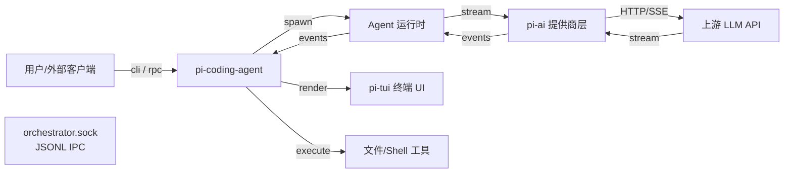
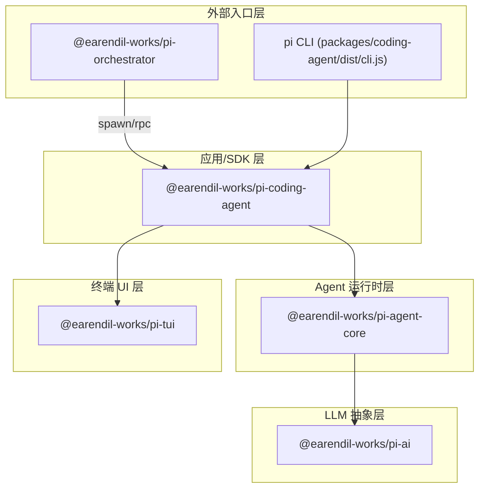
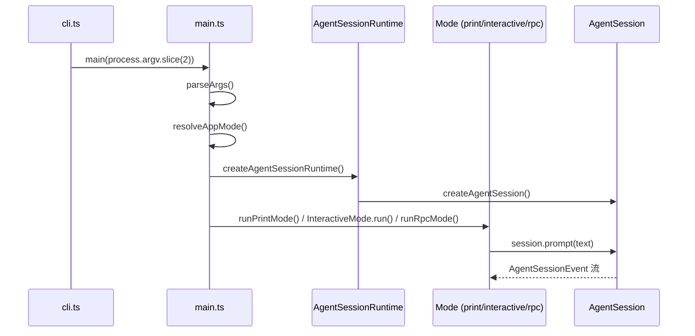
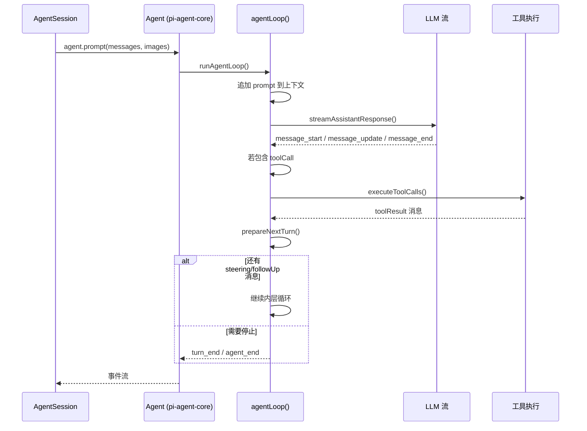
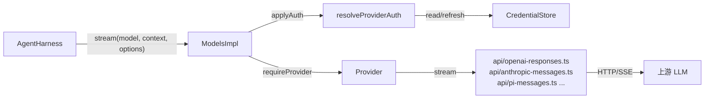
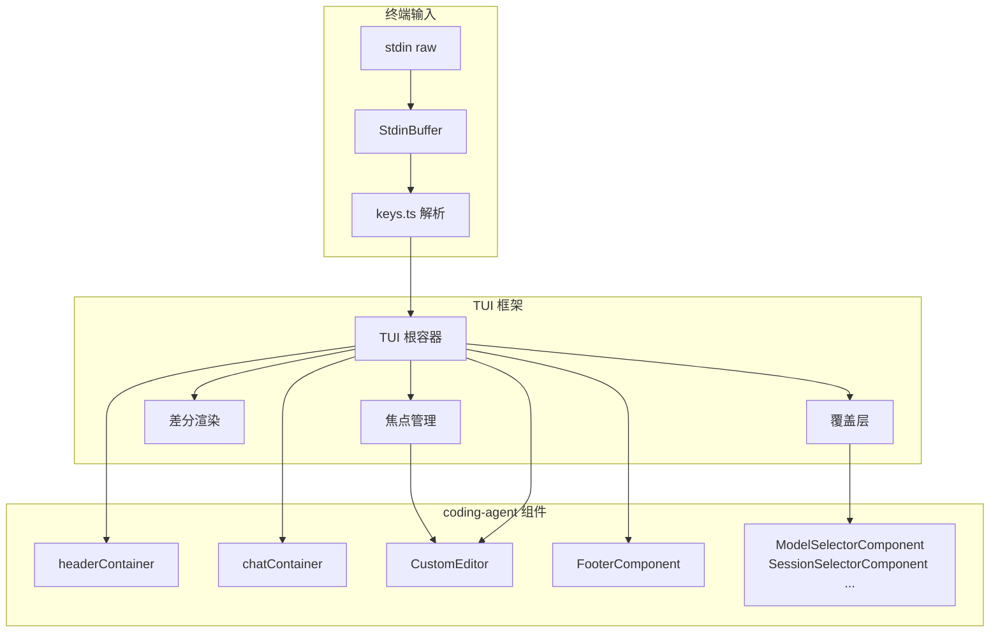
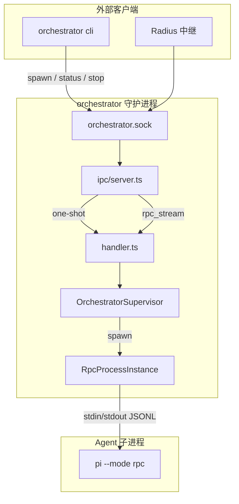

# Pi 软件流程架构分析

> 分析范围：Pi monorepo 五个工作区（`packages/orchestrator`、`packages/coding-agent`、`packages/agent`、`packages/ai`、`packages/tui`）以及它们之间的调用与数据流。

## 目录

- [1. 概览](#1-概览)
- [2. 包架构分层](#2-包架构分层)
- [3. 入口与运行模式](#3-入口与运行模式)
- [4. 核心流程](#4-核心流程)
  - [4.1 CLI 解析与会话解析](#41-cli-解析与会话解析)
  - [4.2 AgentSession 构造](#42-agentsession-构造)
  - [4.3 Agent 循环](#43-agent-循环)
  - [4.4 LLM 提供商抽象](#44-llm-提供商抽象)
  - [4.5 工具执行](#45-工具执行)
  - [4.6 交互式渲染与 TUI](#46-交互式渲染与-tui)
  - [4.7 上下文压缩](#47-上下文压缩)
- [5. Orchestrator 多实例架构](#5-orchestrator-多实例架构)
- [6. 数据持久化](#6-数据持久化)
- [7. 关键文件索引](#7-关键文件索引)

---

## 1. 概览

Pi 是一个模块化、分层设计的 AI 编程助手运行时：

- **`packages/orchestrator`**：可选的本地守护进程，管理多个 `pi-coding-agent` 子进程，通过 Unix Domain Socket 暴露 JSONL IPC。
- **`packages/coding-agent`**：主 CLI/SDK，负责参数解析、会话管理、扩展加载、内置工具、运行模式（交互式/一次性/RPC）。
- **`packages/agent`**：通用 Agent 运行时，提供多轮对话循环、工具调度、状态管理和上下文压缩。
- **`packages/ai`**：统一多提供商 LLM API，封装 OpenAI、Anthropic、Google、Bedrock、Mistral 等协议。
- **`packages/tui`**：终端 UI 库，提供差分渲染、组件树、键盘输入、编辑器和覆盖层。

整体数据流向：



---

## 2. 包架构分层



| 层级 | 包 | 主要职责 |
|------|------|----------|
| 外部入口 | `pi-orchestrator` | 多实例守护、进程监管、RPC 桥接、Radius 中继 |
| 外部入口 | `pi-coding-agent` CLI | 参数解析、模式分发、主函数入口 |
| 应用/SDK | `pi-coding-agent` | 会话管理、扩展、工具、模式实现、配置 |
| Agent 运行时 | `pi-agent-core` | 多轮循环、消息队列、工具调度、压缩、持久化抽象 |
| LLM 抽象 | `pi-ai` | 提供商注册、认证、流式请求、协议转换 |
| 终端 UI | `pi-tui` | 差分渲染、组件、输入、编辑器、覆盖层 |

---

## 3. 入口与运行模式

### 3.1 CLI 入口

- **Node 入口**：`packages/coding-agent/src/cli.ts` → `dist/cli.js`（`bin.pi`）。
- **Bun 二进制入口**：编译后的 `dist/pi` 同样进入 `cli.ts`。
- **Orchestrator 入口**：`packages/orchestrator/src/cli.ts` → `serve` / `spawn` / `rpc` 等子命令。

### 3.2 运行模式

`packages/coding-agent/src/main.ts` 中的 `resolveAppMode()` 决定模式：

| 模式 | 触发条件 | 实现文件 | 说明 |
|------|----------|----------|------|
| `interactive` | 默认 TTY | `modes/interactive/interactive-mode.ts` | 启动 TUI，持续对话 |
| `print` | `--print`、stdin/stdout 非 TTY | `modes/print-mode.ts` | 一次性输出文本 |
| `json` | `--mode json` | `modes/print-mode.ts` | 一次性输出 JSONL 事件流 |
| `rpc` | `--mode rpc` | `modes/rpc/` | 通过 stdin/stdout JSONL 接收 `RpcCommand` |

### 3.3 模式数据流



---

## 4. 核心流程

### 4.1 CLI 解析与会话解析

**文件**：`packages/coding-agent/src/cli/args.ts`、`packages/coding-agent/src/main.ts`

1. `parseArgs()` 手动解析命令行参数，生成 `Args` 对象（包含 `--model`、`--thinking`、`--session`、`--continue`、`--fork` 等）。
2. 若参数为 `--help`、`--list-models`、`install`、`config` 等元命令，直接短路退出。
3. `resolveSessionPath()` 根据 `--session` / `--continue` / `--resume` / `--fork` 解析会话文件路径：
   - 本地项目 `.pi/sessions/*.jsonl`
   - 全局会话目录
   - 直接文件路径
4. `buildSessionOptions()` 将 CLI 参数映射为 `CreateAgentSessionOptions`。

### 4.2 AgentSession 构造

**文件**：

- `packages/coding-agent/src/core/sdk.ts`
- `packages/coding-agent/src/core/agent-session-services.ts`
- `packages/coding-agent/src/core/agent-session-runtime.ts`
- `packages/coding-agent/src/core/agent-session.ts`

构造链：

```
main.ts
  └─ createAgentSessionRuntime(createRuntime)
       └─ createAgentSessionServices()  # 按 cwd 构建服务
            ├─ ModelRuntime
            ├─ SettingsManager
            ├─ DefaultResourceLoader
            └─ 扩展注册
       └─ createAgentSessionFromServices()
            └─ createAgentSession()
                 ├─ 解析模型、思考级别
                 ├─ 实例化 pi-agent-core 的 Agent
                 └─ 返回 AgentSession
```

`AgentSession` 是 `coding-agent` 的核心抽象，职责包括：

- 管理 `Agent` 实例、扩展运行时、会话持久化。
- 提供 `prompt()`、`steer()`、`followUp()`、`abort()`、`compact()`。
- 处理 slash 命令（`/new`、`/fork`、`/model`、`/compact` 等）。
- 在 `agent_start` / `message_end` / `turn_end` 等事件点上持久化会话。

### 4.3 Agent 循环

**文件**：

- `packages/agent/src/agent-loop.ts`：底层循环实现。
- `packages/agent/src/agent.ts`：有状态包装器。
- `packages/agent/src/harness/agent-harness.ts`：生产级 harness，连接会话、模型、工具、资源。



`Agent` 包装器维护：

- `_state`：系统提示词、模型、思考级别、消息历史、工具列表。
- `steeringQueue` / `followUpQueue`：运行中/运行后注入用户消息。
- `activeRun`：当前运行的 AbortController 和 Promise。

`AgentHarness` 在 `Agent` 之上添加：

- 从 `Session` 构建上下文。
- 工具前后钩子（`beforeToolCall` / `afterToolCall`）。
- 提供商请求前后钩子（`before_provider_request` / `after_provider_response`）。
- 待写入缓冲（`pendingSessionWrites`）在 `turn_end` / `agent_end` 时刷盘。

### 4.4 LLM 提供商抽象

**文件**：

- `packages/ai/src/models.ts`
- `packages/ai/src/auth/resolve.ts`
- `packages/ai/src/api/*.ts`
- `packages/ai/src/providers/*.ts`



请求流程：

1. `Models.stream(model, context, options)` 立即返回 `AssistantMessageEventStream`（通过 `lazyStream` 隐藏异步）。
2. 在 lazy setup 中，`requireProvider(model)` 按 `model.provider` 查找 Provider。
3. `applyAuth()` 调用 `resolveProviderAuth()`：
   - 显式 `apiKey`/`env` 覆盖 > 存储的凭证（API key 或 OAuth）> 环境变量。
   - OAuth 过期时通过 `CredentialStore.modify()` 刷新并持久化。
4. Provider 调用对应的 API 模块（如 `openai-responses.ts`）。
5. API 模块将归一化的 `Context` 转换为提供商特定请求体，创建 SDK 客户端，发起流式请求。
6. 上游事件被解析为标准 `AssistantMessageEvent`：`start`、`text_delta`、`thinking_*`、`toolcall_*`、`done`、`error`。

### 4.5 工具执行

**文件**：

- `packages/coding-agent/src/core/tools/index.ts`
- `packages/coding-agent/src/core/tools/read.ts`、`bash.ts`、`edit.ts`、`write.ts`、`grep.ts`、`find.ts`、`ls.ts`
- `packages/agent/src/agent-loop.ts` 中 `executeToolCalls()`

工具注册：

- `AgentSession` 通过 `createAllToolDefinitions()` / `createAllTools()` 构建内置工具定义。
- 扩展通过 `ExtensionRunner` 注册额外工具和命令。

执行流程：

1. LLM 返回 `toolCall` 内容块。
2. `agent-loop.ts` 的 `executeToolCalls()` 根据 `toolExecution` 配置选择串行或并行执行。
3. `prepareToolCall()`：查找工具、验证参数、运行 `beforeToolCall` 钩子。
4. `executePreparedToolCall()`：调用 `tool.execute()`，可返回流式更新。
5. `finalizeExecutedToolCall()`：运行 `afterToolCall` 钩子。
6. 生成 `toolResult` 消息追加到上下文。

内置工具：

| 工具 | 功能 |
|------|------|
| `read` | 读取文件内容，支持行范围、图片 |
| `bash` | 执行 shell 命令，支持 `!` 快捷命令 |
| `edit` | 基于 diff 的代码编辑 |
| `write` | 写入/覆盖文件 |
| `grep` | 文本搜索 |
| `find` | 文件查找 |
| `ls` | 目录列表 |

### 4.6 交互式渲染与 TUI

**文件**：

- `packages/tui/src/tui.ts`
- `packages/tui/src/terminal.ts`
- `packages/tui/src/components/*.ts`
- `packages/coding-agent/src/modes/interactive/interactive-mode.ts`
- `packages/coding-agent/src/modes/interactive/components/*.ts`



交互式模式数据流：

1. `ProcessTerminal` 启用 raw mode、Kitty keyboard protocol、bracketed paste。
2. `StdinBuffer` 将原始输入切分为完整按键序列，识别粘贴事件。
3. `TUI.handleInput()` 将输入路由到当前焦点组件（通常是 `CustomEditor`）。
4. `CustomEditor` 优先处理应用快捷键（中断、退出、粘贴图片、扩展快捷键），其余交给 `Editor`。
5. 用户提交后，`InteractiveMode` 调用 `session.prompt(text)`。
6. `AgentSessionEvent` 流驱动 `chatContainer` 中的组件更新（`UserMessageComponent`、`AssistantMessageComponent`、`ToolExecutionComponent` 等）。
7. 每次状态变化调用 `TUI.requestRender()`，`TUI` 差分比较前后帧，只重写变化行。
8. 覆盖层（如模型选择器）通过 `showOverlay()` 居中弹出，关闭后焦点返回编辑器。

### 4.7 上下文压缩

**文件**：

- `packages/agent/src/harness/compaction/compaction.ts`
- `packages/agent/src/harness/session/session.ts`
- `packages/coding-agent/src/core/compaction/index.ts`

当上下文 token 数超过阈值（`contextWindow - reserveTokens`）时触发压缩：

1. `AgentHarness.compact()` → `prepareCompaction()`：
   - 找到上一次的压缩点。
   - 计算 cut point，保留最近的 `keepRecentTokens`。
   - 收集需要摘要的历史消息。
2. `compact()`：
   - 将历史消息发送给模型生成结构化摘要。
   - 处理跨回合切断的情况，生成 turn prefix 摘要。
   - 返回 `CompactionResult`。
3. `session.appendCompaction()` 写入 `compaction` 条目。
4. 后续 `Session.buildContext()` 自动将压缩点之前的条目替换为摘要条目，从而缩小上下文。

---

## 5. Orchestrator 多实例架构

**文件**：

- `packages/orchestrator/src/serve.ts`
- `packages/orchestrator/src/supervisor.ts`
- `packages/orchestrator/src/rpc-process.ts`
- `packages/orchestrator/src/ipc/server.ts`、`ipc/client.ts`、`ipc/protocol.ts`



实例生命周期：

1. `spawn`：创建 `InstanceRecord`，持久化到 `instances.json`，启动子进程。
2. `bindRpcProcess()`：将子进程 stdout 的 JSONL 事件转发给订阅者。
3. `syncInstanceRecord()`：发送 `get_state` RPC，保存 `sessionId` / `sessionFile`。
4. `radiusPresence.registerPi()`：可选注册到 Radius 中继。
5. `rpc_stream`：客户端与 orchestrator 建立长连接，orchestrator 与子进程 stdin/stdout 桥接，实现双向 JSONL 流。
6. `stop`：清理订阅、断开 Radius、发送 SIGTERM、更新状态为 `stopped`。

---

## 6. 数据持久化

| 数据 | 位置 | 说明 |
|------|------|------|
| 会话历史 | `.pi/sessions/<id>.jsonl` | 树状结构的消息、模型变更、思考级别变更、压缩摘要 |
| 设置 | `.pi/settings.json` | 用户偏好、模型、 Provider 凭证引用 |
| 凭证 | 系统密钥存储 / `.pi/credentials` | API key / OAuth token（由 `CredentialStore` 抽象） |
| 模型缓存 | `~/.pi/models-store.json` | 各 Provider 的动态模型列表缓存 |
| Orchestrator 实例 | `~/.pi/orchestrator/instances.json` | 实例元数据 |
| Orchestrator 机器身份 | `~/.pi/orchestrator/machine.json` | Radius 注册信息 |

会话条目类型（`SessionTreeEntry`）：

- `message`
- `thinking_level_change`
- `model_change`
- `active_tools_change`
- `compaction`
- `branch_summary`
- `custom` / `custom_message`
- `label`
- `session_info`
- `leaf`

---

## 7. 关键文件索引

### Orchestrator

| 文件 | 职责 |
|------|------|
| `packages/orchestrator/src/cli.ts` | orchestrator 命令行入口 |
| `packages/orchestrator/src/serve.ts` | 守护进程启动、优雅退出 |
| `packages/orchestrator/src/supervisor.ts` | 实例生命周期监管 |
| `packages/orchestrator/src/rpc-process.ts` | Agent 子进程封装与 JSONL 通信 |
| `packages/orchestrator/src/ipc/server.ts` | Unix socket 服务器、流升级 |
| `packages/orchestrator/src/ipc/protocol.ts` | IPC 消息协议类型 |
| `packages/orchestrator/src/radius.ts` | Radius 中继注册与心跳 |

### Coding Agent

| 文件 | 职责 |
|------|------|
| `packages/coding-agent/src/cli.ts` | `pi` CLI 入口 |
| `packages/coding-agent/src/main.ts` | 参数解析、模式路由、会话/运行时构建 |
| `packages/coding-agent/src/core/sdk.ts` | 程序化 SDK：`createAgentSession()` |
| `packages/coding-agent/src/core/agent-session-services.ts` | 按 cwd 构建服务 |
| `packages/coding-agent/src/core/agent-session-runtime.ts` | 运行时与会话切换 |
| `packages/coding-agent/src/core/agent-session.ts` | 核心会话抽象与事件流 |
| `packages/coding-agent/src/core/extensions/index.ts` | 扩展系统 |
| `packages/coding-agent/src/core/tools/index.ts` | 内置工具工厂 |
| `packages/coding-agent/src/modes/print-mode.ts` | 一次性文本/JSON 模式 |
| `packages/coding-agent/src/modes/interactive/interactive-mode.ts` | 交互式 TUI 模式 |
| `packages/coding-agent/src/modes/rpc/` | RPC 模式 |

### Agent Core

| 文件 | 职责 |
|------|------|
| `packages/agent/src/agent.ts` | 有状态 Agent 包装器 |
| `packages/agent/src/agent-loop.ts` | 多轮 LLM/工具循环 |
| `packages/agent/src/types.ts` | 核心类型 |
| `packages/agent/src/harness/agent-harness.ts` | 生产级 harness |
| `packages/agent/src/harness/session/session.ts` | 树状会话存储抽象 |
| `packages/agent/src/harness/compaction/compaction.ts` | 上下文压缩 |
| `packages/agent/src/harness/prompt-templates.ts` | 提示词模板加载 |

### AI

| 文件 | 职责 |
|------|------|
| `packages/ai/src/models.ts` | Provider / Models 注册与调度 |
| `packages/ai/src/models-store.ts` | 动态模型列表缓存 |
| `packages/ai/src/types.ts` | 统一消息/上下文/事件类型 |
| `packages/ai/src/auth/resolve.ts` | 认证解析与 OAuth 刷新 |
| `packages/ai/src/auth/credential-store.ts` | 凭证存储默认实现 |
| `packages/ai/src/api/lazy.ts` | 懒加载流封装 |
| `packages/ai/src/api/pi-messages.ts` | Pi 自有协议 |
| `packages/ai/src/api/openai-responses.ts` | OpenAI Responses API |
| `packages/ai/src/api/anthropic-messages.ts` | Anthropic Messages API |
| `packages/ai/src/providers/faux.ts` | 测试用伪 Provider |

### TUI

| 文件 | 职责 |
|------|------|
| `packages/tui/src/tui.ts` | TUI 根容器、差分渲染、焦点、覆盖层 |
| `packages/tui/src/terminal.ts` | 终端抽象、协议协商 |
| `packages/tui/src/stdin-buffer.ts` | 原始输入缓冲与序列切分 |
| `packages/tui/src/keys.ts` | 按键序列解析 |
| `packages/tui/src/keybindings.ts` | 快捷键注册 |
| `packages/tui/src/components/editor.ts` | 多行编辑器 |
| `packages/tui/src/components/markdown.ts` | Markdown 渲染 |
| `packages/tui/src/components/select-list.ts` | 选择列表 |
| `packages/tui/src/components/box.ts` | 带背景的容器 |

---

## 总结

Pi 的架构呈现清晰的纵向分层：

1. **入口层**（CLI / Orchestrator）负责启动和外部连接。
2. **应用层**（`coding-agent`）承载产品级语义：会话、扩展、工具、配置、UI。
3. **运行时层**（`agent-core`）提供与产品无关的 Agent 循环、状态、压缩。
4. **LLM 层**（`ai`）将多提供商差异收敛为统一的消息/事件/认证模型。
5. **UI 层**（`tui`）提供高效差分渲染的终端组件系统。

核心控制流是：用户输入 → `AgentSession.prompt()` → `Agent` 循环 → `Models.stream()` → 上游 LLM → 流式事件 → 工具执行 → 事件持久化 → UI/stdout 渲染。扩展和钩子机制贯穿整个流程，允许在输入、LLM 请求、工具调用、输出渲染等节点注入自定义行为。
